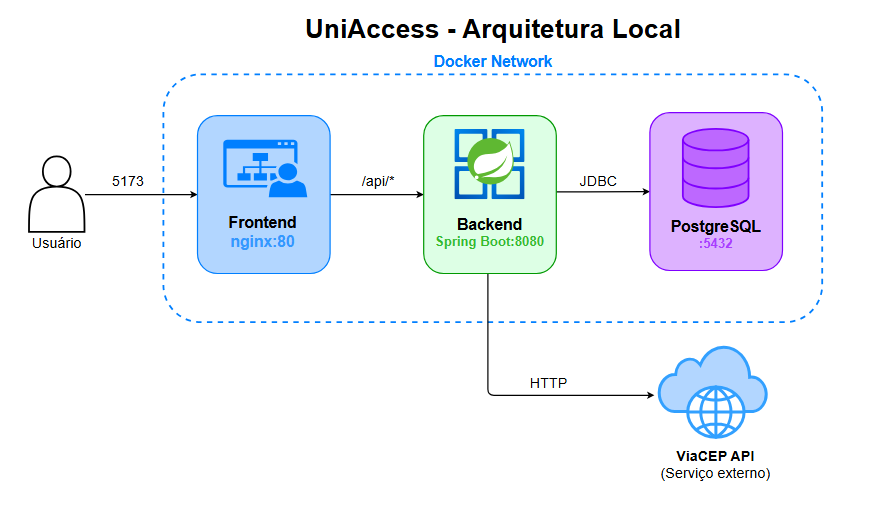

<div align="center">

<br/>


<br/>

**Desafio Técnico — Engenharia de Software Jr.**

<br/>


</div>

---

## Sumário

- [Sobre o projeto](#sobre-o-projeto)
- [Como rodar](#como-rodar)
- [Endpoints](#endpoints)
- [Validações](#validações)
- [Geração automática de login](#geração-automática-de-login)
- [Estrutura do projeto](#estrutura-do-projeto)
- [Tech stack](#tech-stack)

### Documentação adicional

| Documento | Descrição |
| -------------------------------------------------------- | -------------------------------------------- |
| [docs/EVIDENCIAS.md](docs/EVIDENCIAS.md) | Evidências de testes com prints |
| [docs/DECISOES_TECNICAS.md](docs/DECISOES_TECNICAS.md) | Por que cada decisão técnica foi tomada |
| [docs/AWS_DEPLOYMENT.md](docs/AWS_DEPLOYMENT.md) | EXTRA — Prévia de arquitetura AWS |
| [docs/CASE.md](docs/CASE.md) | Enunciado original do case técnico |

### 🎬 Vídeos

| Vídeo | Descrição |
| ----------------------------------------------------------------- | ------------------------------------------------------ |
| [▶ Docker Compose rodando](https://youtu.be/CkmTJIqJPjY) | Passo a passo completo subindo a aplicação com Docker |
| [▶ Cadastro e login pelo frontend](https://youtu.be/U2H1cLV6w0E) | Fluxo de cadastro até o login bem-sucedido na interface |
| [▶ Defesa das decisões técnicas](https://youtu.be/754q7458muI) | Explicação e defesa das escolhas de arquitetura e tech |

---

## Sobre o projeto

Aplicação **full stack** de cadastro de pessoas com geração automática de login. Interface web (**UniAccess**) em React e backend REST em Spring Boot, orquestrados por Docker Compose.

- Valida todos os campos de entrada (nome, CPF com dígito verificador, e-mail, data de nascimento, CEP)
- Consulta o endereço automaticamente via ViaCEP — o frontend nunca chama APIs externas diretamente (padrão BFF)
- Persiste os dados em PostgreSQL com migrations versionadas via Flyway
- **Gera automaticamente um login único de 7 letras** derivado do nome da pessoa
- Exibe os dados cadastrados com o login gerado ao final do fluxo

### Arquitetura



O **nginx** serve o frontend React e atua como proxy reverso — todas as chamadas `/api/*` são redirecionadas internamente para o **Spring Boot**, que persiste no **PostgreSQL**. O browser nunca conhece a porta do backend; para ele, tudo está em `localhost:5173`.

> Para detalhes de cada decisão de arquitetura — por que nginx, por que Vite + Tailwind, como funciona o Docker Compose — veja [docs/DECISOES_TECNICAS.md](docs/DECISOES_TECNICAS.md).

---

## Como rodar

### ▶ Com Docker (recomendado)


Pré-requisito: [Docker Desktop](https://www.docker.com/products/docker-desktop/)

🎬 **Vídeo tutorial:** veja o passo a passo completo rodando com Docker em [youtu.be/CkmTJIqJPjY](https://youtu.be/CkmTJIqJPjY)

```bash
docker-compose up --build
```

Sobe os três serviços em ordem: PostgreSQL → Backend (migrations automáticas) → Frontend (nginx).

| O quê | URL |
| ----------------- | ------------------------------------- |
| **Interface web** | http://localhost:5173 |
| Swagger UI | http://localhost:8080/swagger-ui |
| Health | http://localhost:8080/actuator/health |

> **Primeiro build:** Maven baixa as dependências do zero — pode levar 3–5 min. Builds seguintes usam cache.


---

### 🛠 Rodando localmente (modo dev)

Pré-requisitos: Java 21 · Maven · Node.js 22+ · PostgreSQL 16+

```bash
# 1. Banco
docker-compose up -d postgres

# 2. Backend
cd backend/identity-provisioning-api
mvn spring-boot:run

# 3. Frontend
cd frontend
npm install && npm run dev
```

As chamadas à API são proxiadas automaticamente pelo Vite para `localhost:8080`.

---

## Dados para teste

Ao subir com `docker-compose up --build`, o banco já vem com **20 cadastros legados** inseridos automaticamente pela migration `V2`. Use os dados abaixo para explorar a aplicação sem precisar cadastrar nada primeiro.

### Cadastrar uma nova pessoa (fluxo principal)

Dados completos prontos para usar no formulário — nenhum desses CPFs está na base:

| Nome | CPF | Data de nascimento | E-mail | CEP sugerido |
| -------------------------- | --------------- | ------------------ | ------------------------------ | ------------ |
| Fernanda Cristina Barbosa | `845.213.769-91` | `1992-08-23` | `fernanda.barbosa@email.com` | `01310-100` |
| Rafael Augusto Mendes | `376.094.825-10` | `1987-11-15` | `rafael.mendes@email.com` | `30130-010` |
| Juliana Costa Freitas | `261.854.037-90` | `2001-04-07` | `juliana.freitas@email.com` | `80010-010` |

> O endereço preenche automaticamente ao sair do campo CEP.

---

## Endpoints

### `POST /api/persons` — cadastrar pessoa

```json
{
  "fullName": "Fernanda Cristina Barbosa",
  "document": "845.213.769-91",
  "email": "fernanda.barbosa@email.com",
  "dateOfBirth": "1992-08-23",
  "zipCode": "01310-100",
  "street": "Avenida Paulista",
  "neighborhood": "Bela Vista",
  "city": "São Paulo",
  "state": "SP",
  "complement": "Apto 301"
}
```

Resposta `201 Created`:

```json
{
  "id": 21,
  "fullName": "Fernanda Cristina Barbosa",
  "document": "845.213.769-91",
  "email": "fernanda.barbosa@email.com",
  "dateOfBirth": "1992-08-23",
  "login": "fernand",
  "createdAt": "2026-05-31T10:00:00"
}
```

### `GET /api/zip-code/{zipCode}` — buscar endereço pelo CEP

```json
{ "zipCode": "01310-100", "street": "Avenida Paulista", "neighborhood": "Bela Vista", "city": "São Paulo", "state": "SP" }
```

### `GET /api/persons` — listar pessoas (paginado)

```
GET /api/persons?page=0&size=10&sort=fullName,asc
```

### `GET /api/persons/{id}` — buscar por id

### `GET /api/persons/login/{login}` — buscar pelo login

### `GET /api/persons/email/{email}` — recuperar login pelo e-mail

Fluxo "Esqueci meu login" — retorna os dados da pessoa a partir do e-mail cadastrado.

### `DELETE /api/persons/{id}` — remover

---

## Validações

| Campo | Regras |
| ----------------------------------------- | ---------------------------------------------------------------------------- |
| `fullName` | Obrigatório, mínimo 2 palavras, apenas letras (acentos aceitos, sem números ou símbolos) |
| `document` | Obrigatório, CPF com dígito verificador válido |
| `email` | Obrigatório, formato válido |
| `dateOfBirth` | Obrigatório, não pode ser futura |
| `zipCode` | Obrigatório, formato `XXXXX-XXX` ou `XXXXXXXX` |
| `street`, `neighborhood`, `city`, `state` | Obrigatórios |

Erros retornam no padrão **RFC 7807 Problem Details**:

```json
{ "type": "about:blank", "title": "Validation failed", "status": 400, "errors": ["must be a valid CPF"] }
```

---

## Geração automática de login

Ao cadastrar, o sistema gera um **login de exatamente 7 letras minúsculas (a–z)** derivado do nome — sem números, sem repetição.

| Nome | Login gerado |
| --------------------- | ------------ |
| Maria Silva Santos | `mariasi` |
| João Pedro Silva | `joaoped` |
| Ana Clara Souza | `anaclar` |
| Carlos Eduardo Lima | `carlose` |
| Conceição Araújo Lima | `conceic` |

O algoritmo tenta 8 estratégias em cascata (combinações de nome + sobrenomes, inversão, janela deslizante, fallback com enumeração) e retorna o primeiro login disponível no banco. Unicidade garantida em dois níveis: verificação em código + `UNIQUE CONSTRAINT` no banco.

> Explicação completa do algoritmo: [docs/DECISOES_TECNICAS.md → Geração automática de login](docs/DECISOES_TECNICAS.md#geração-automática-de-login)

---

## Estrutura do projeto

```
case-itau/
├── .github/workflows/ci.yml              # Pipeline CI (compile · tests · lint · build)
├── docs/
│   ├── EVIDENCIAS.md                     # Prints de evidência
│   ├── DECISOES_TECNICAS.md              # Por que cada decisão foi tomada
│   └── prints/
├── frontend/                             # React 19 + TypeScript + Vite + Tailwind
│   ├── src/
│   │   ├── components/                   # PersonForm, SuccessCard, LoginForm, RecoverLoginForm…
│   │   ├── services/api.ts               # Chamadas ao backend
│   │   ├── types/
│   │   └── utils/                        # validators.ts · masks.ts
│   ├── Dockerfile                        # multi-stage: Node → nginx
│   └── nginx.conf
└── backend/identity-provisioning-api/
    ├── Dockerfile                        # multi-stage: Maven → JRE
    └── src/main/java/com/itau/identityprovisioning/
        ├── controller/
        ├── domain/
        │   ├── person/                   # entidade, service, repositório, DTOs, validações
        │   └── zipcode/                  # integração ViaCEP
        ├── infra/
        │   ├── exception/                # HandlingErrors (RFC 7807)
        │   └── http/                     # RestClient, CorsConfig
        └── login/
            ├── LoginGenerator.java       # algoritmo de geração
            └── LoginAvailabilityChecker  # interface funcional (desacopla do banco)
```

---

## Tech stack

| Camada | Tecnologia |
| --------------- | ----------------------------------------------- |
| Linguagem | Java 21 |
| Framework | Spring Boot 3.4.4 |
| Persistência | Spring Data JPA + PostgreSQL 16 |
| Migrations | Flyway |
| Validação | Bean Validation + validators customizados |
| Documentação | SpringDoc OpenAPI (Swagger UI) |
| Observabilidade | Spring Boot Actuator |
| Testes | JUnit 5 + Mockito |
| Build | Maven |
| **Frontend** | React 19 + TypeScript + Vite + Tailwind CSS |
| **Infra** | Docker Compose + nginx |
| **CI** | GitHub Actions (compile · tests · lint · build) |
