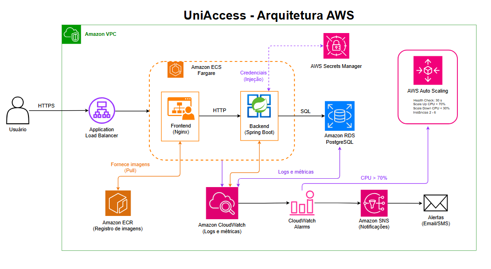

# EXTRA — Prévia de Arquitetura AWS

> Esboço de como o UniAccess seria provisionado na AWS em produção.  
> As imagens Docker (frontend e backend) seriam publicadas no **ECR** e orquestradas pelo **ECS Fargate**.

---

## Serviços utilizados

| Serviço | Para que serve |
|---|---|
| **ECR** | Repositório privado das imagens Docker do frontend e do backend |
| **ECS Fargate + Auto Scaling** | Executa os containers sem gerenciar servidores — escala automaticamente conforme o tráfego |
| **RDS PostgreSQL Multi-AZ** | Banco gerenciado replicado em duas zonas — se uma cair, a outra assume sem downtime |
| **Application Load Balancer** | Recebe o tráfego e distribui entre os containers |
| **WAF** | Firewall na frente do ALB — bloqueia SQL injection, XSS e brute force |
| **Secrets Manager** | Armazena credenciais do banco com segurança — nunca em código |
| **VPC** | Rede privada isolando as camadas da aplicação |
| **Route 53 + ACM** | Configuração de domínio e certificado SSL |
| **CloudWatch** | Coleta logs e métricas dos containers (CPU, memória, erros) e dispara alarmes |
| **SNS** | Envia notificações quando um alarme é ativado — e-mail, Slack ou SMS |

---

## Arquitetura

O diagrama ilustra o fluxo completo da aplicação na AWS:

- O **Usuário** acessa via HTTPS pelo **Application Load Balancer**, que distribui o tráfego para os containers no **ECS Fargate** — um rodando o frontend (nginx) e outro o backend (Spring Boot), ambos dentro da **VPC**
- O **Backend** consulta o **Amazon RDS PostgreSQL** via SQL e recebe as credenciais do banco injetadas pelo **AWS Secrets Manager**
- As imagens Docker de ambos os containers são armazenadas no **Amazon ECR** e puxadas pelo ECS no momento do deploy
- O **Amazon CloudWatch** coleta logs e métricas dos containers e do banco, disparando alertas via **CloudWatch Alarms** → **Amazon SNS** → e-mail ou SMS
- O **AWS Auto Scaling** monitora a CPU e escala automaticamente o número de containers conforme a demanda (Scale Up: CPU > 70% · Scale Down: CPU < 30% · Instâncias: 2–6)

---

## Fluxo de deploy

1. Build das imagens Docker localmente
2. Push para o **ECR** (frontend e backend)
3. **ECS Fargate** puxa as novas imagens e faz rolling deploy automaticamente
4. Domínio e SSL configurados via **Route 53 + ACM**

---