# Evidências de Testes — UniAccess

> Documento de evidências do funcionamento da aplicação.  
> Cobre todos os fluxos exigidos pelo case técnico — prints e testes automatizados.

---

## Sumário

- [1. Ambiente rodando](#1-ambiente-rodando)
- [2. Fluxo de cadastro — sucesso](#2-fluxo-de-cadastro--sucesso)
- [3. Validações — erros no formulário](#3-validações--erros-no-formulário)
- [4. Validação de CPF duplicado](#4-validação-de-cpf-duplicado)
- [5. Consulta automática de CEP](#5-consulta-automática-de-cep)
- [6. Unicidade do login](#6-unicidade-do-login)
- [7. Fluxo de login](#7-fluxo-de-login)
- [8. Recuperação de login por e-mail](#8-recuperação-de-login-por-e-mail)
- [9. Testes automatizados](#9-testes-automatizados)
- [10. API — Swagger UI](#10-api--swagger-ui)

---

## 1. Ambiente rodando

### Docker Compose — todos os serviços no ar

> `docker-compose up --build` executado com sucesso. Três serviços ativos: postgres, backend e frontend.

<!-- Adicione o print abaixo -->

---

### Interface acessível em localhost:5173

> Tela inicial do UniAccess no browser após `docker-compose up`.

<!-- Adicione o print abaixo -->
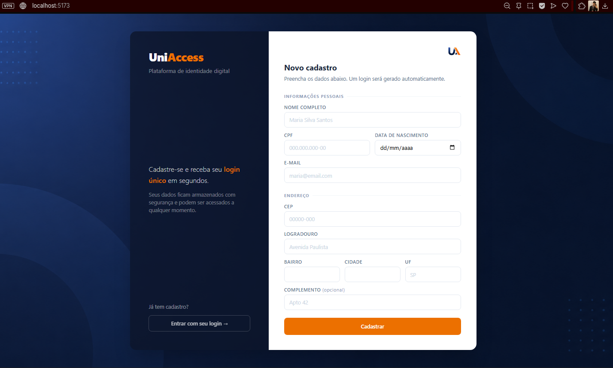

---

## 2. Fluxo de cadastro — sucesso

### Formulário preenchido com dados válidos

> Todos os campos preenchidos corretamente: nome, CPF, e-mail, data de nascimento, CEP com endereço preenchido automaticamente.

<!-- Adicione o print abaixo -->
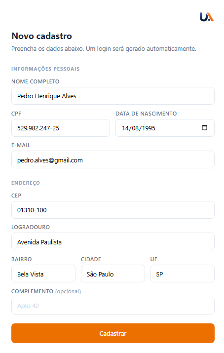

---

### Tela de sucesso com login gerado

> Após envio, o sistema exibe o login único de 7 letras gerado automaticamente a partir do nome.

<!-- Adicione o print abaixo -->

---

## 3. Validações — erros no formulário

### Nome inválido

> Tentativa de envio com nome contendo números, símbolos ou apenas uma palavra.

<!-- Adicione o print abaixo -->
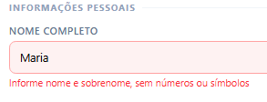

---

### CPF inválido

> Tentativa de envio com CPF com dígito verificador incorreto ou sequência inválida (ex: 111.111.111-11).

<!-- Adicione o print abaixo -->
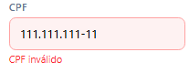
---

### E-mail inválido

> Tentativa de envio com e-mail sem formato válido.

<!-- Adicione o print abaixo -->
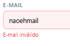

---

### Data de nascimento futura

> Tentativa de envio com data de nascimento posterior à data atual.

<!-- Adicione o print abaixo -->
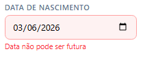

---

### CEP não encontrado

> Tentativa de consulta com CEP inválido ou inexistente.

<!-- Adicione o print abaixo -->
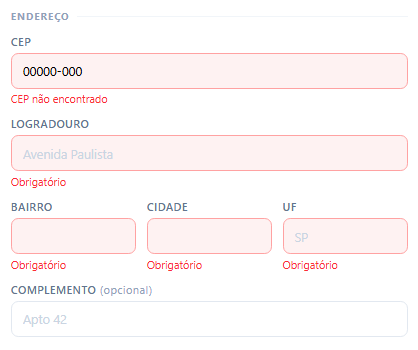

---

### Campos obrigatórios vazios

> Tentativa de envio do formulário sem preencher os campos obrigatórios.

<!-- Adicione o print abaixo -->
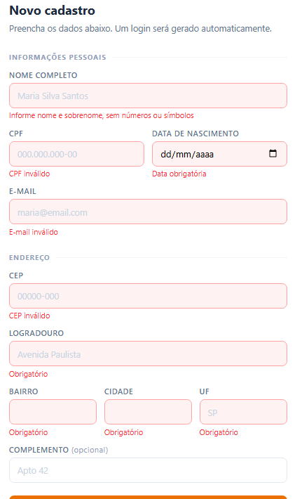
---

## 4. Validação de CPF duplicado

> Tentativa de cadastro com CPF já existente na base. O sistema retorna erro `409 Conflict` e exibe mensagem ao usuário.

<!-- Adicione o print abaixo -->
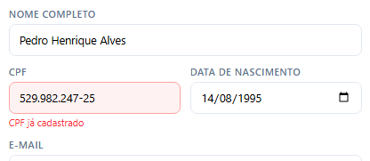

---

## 5. Consulta automática de CEP

### CEP digitado — endereço preenchido automaticamente

> Ao sair do campo CEP, os campos de logradouro, bairro, cidade e UF são preenchidos automaticamente via ViaCEP (padrão BFF — o frontend nunca chama o ViaCEP diretamente).

<!-- Adicione o print abaixo -->
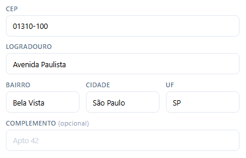
---

## 6. Unicidade do login

> Dois cadastros com nomes similares (ex: "Pedro Henrique Alves" e "Pedro Henrique Santos") geram logins **diferentes**, demonstrando o algoritmo de unicidade.

### Primeiro cadastro

<!-- Adicione o print abaixo -->

---

### Segundo cadastro com nome similar

<!-- Adicione o print abaixo -->
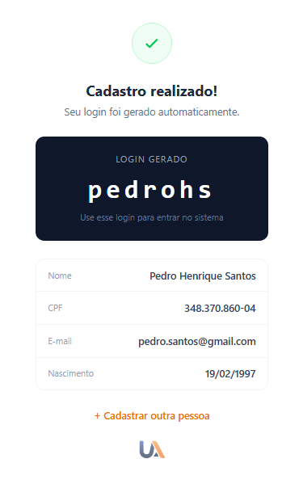
---

## 7. Fluxo de login

### Tela de login

> Usuário acessa a tela de login e digita o login gerado no cadastro.

<!-- Adicione o print abaixo -->
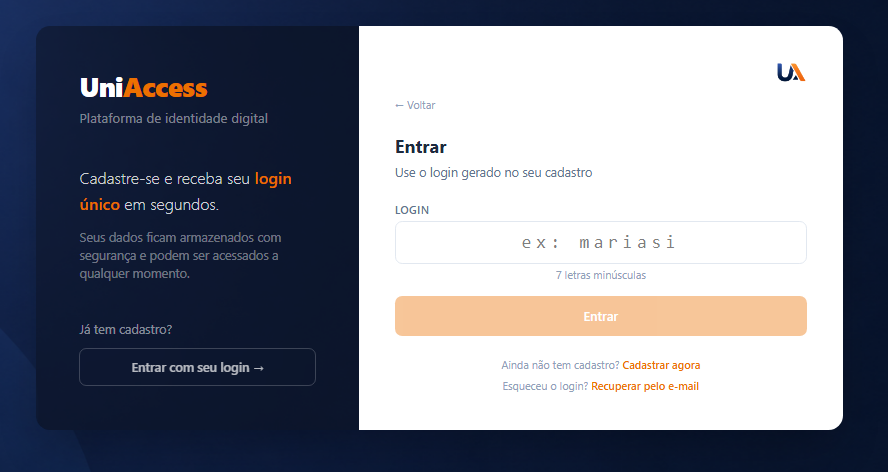

---

### Tela de boas-vindas (logado)

> Após login bem-sucedido, a tela exibe os dados da pessoa com o login utilizado.

<!-- Adicione o print abaixo -->
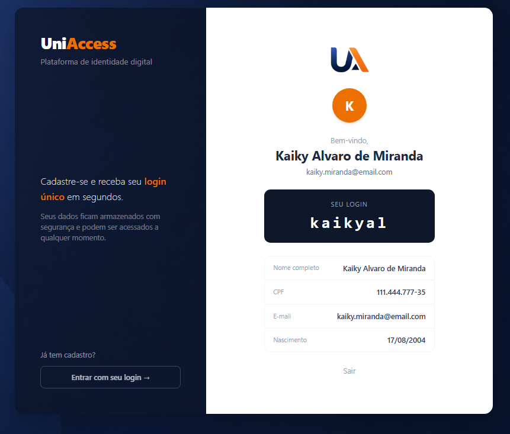
---

### Login não encontrado

> Tentativa de login com código inexistente na base.

<!-- Adicione o print abaixo -->
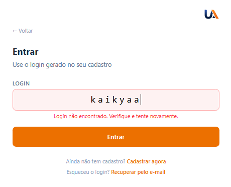
---

## 8. Recuperação de login por e-mail

> Fluxo implementado além do escopo mínimo — resolve o caso em que o usuário esquece o login gerado e fica sem acesso.

### Link "Esqueceu o login?" na tela de login

> O link aparece abaixo do formulário de login e leva ao fluxo de recuperação.

### Formulário de recuperação — e-mail digitado

> Usuário informa o e-mail usado no cadastro.

<!-- Adicione o print abaixo -->
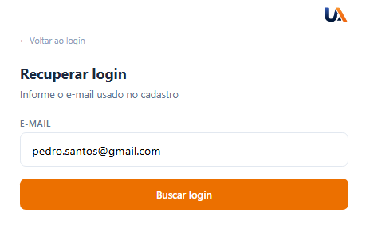
---

### Login recuperado com sucesso

> O sistema exibe o login de 7 letras em destaque e o nome da pessoa, com botão para ir direto ao login.

<!-- Adicione o print abaixo -->
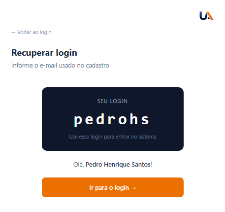

---

### E-mail não encontrado

> Tentativa de recuperação com e-mail não cadastrado.

<!-- Adicione o print abaixo -->
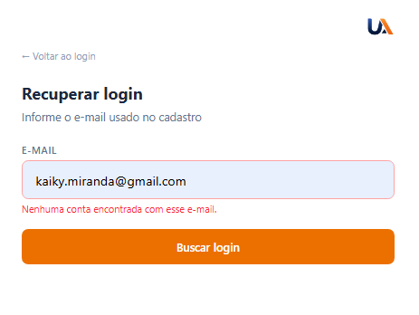
---

## 9. Testes automatizados

### Suite de testes passando

> Execução de `mvn test` com todos os testes verdes. Cobre o `LoginGenerator` com TDD: happy path, colisões, nomes com acentos, nomes curtos e as três invariantes do login.

<!-- Adicione o print abaixo -->
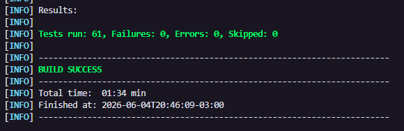
---

### CI/GitHub Actions — pipeline verde

> Pipeline rodando no GitHub Actions após push: Backend Compile → Backend Tests → Frontend Lint → Frontend Build.

<!-- Adicione o print abaixo -->
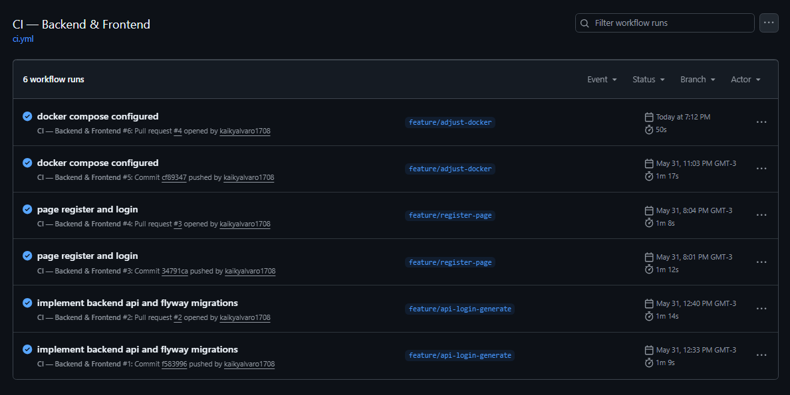
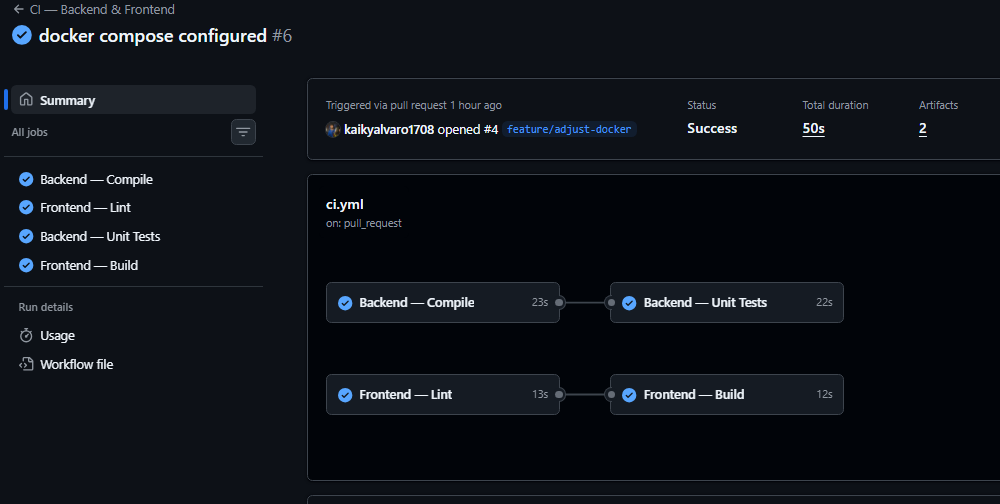
---

## 10. API — Swagger UI

### Documentação interativa dos endpoints

> Swagger UI disponível em `http://localhost:8080/swagger-ui` com todos os endpoints documentados.

<!-- Adicione o print abaixo -->
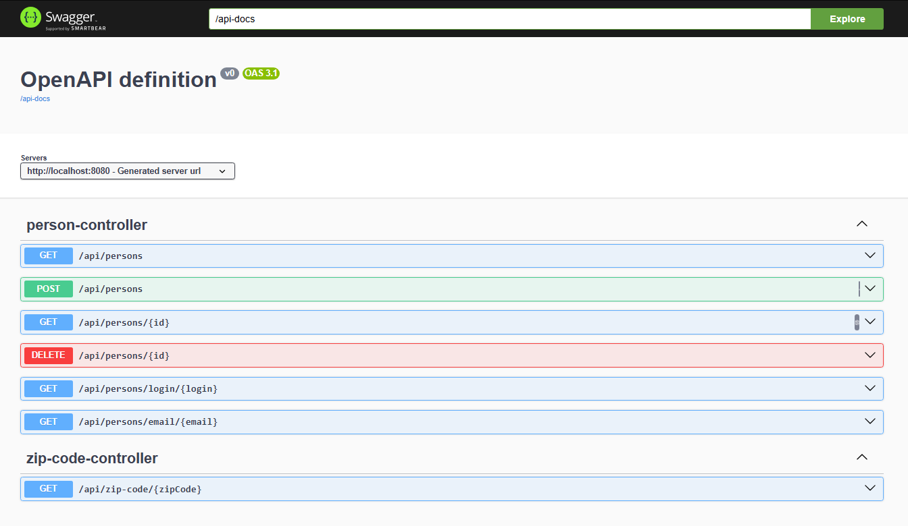

---

### Endpoint POST /api/persons — testado via Swagger

> Requisição de cadastro executada diretamente pelo Swagger com resposta `201 Created` e login gerado no body.

<!-- Adicione o print abaixo -->
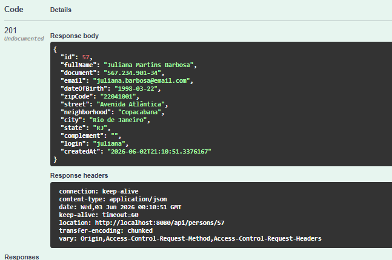
---